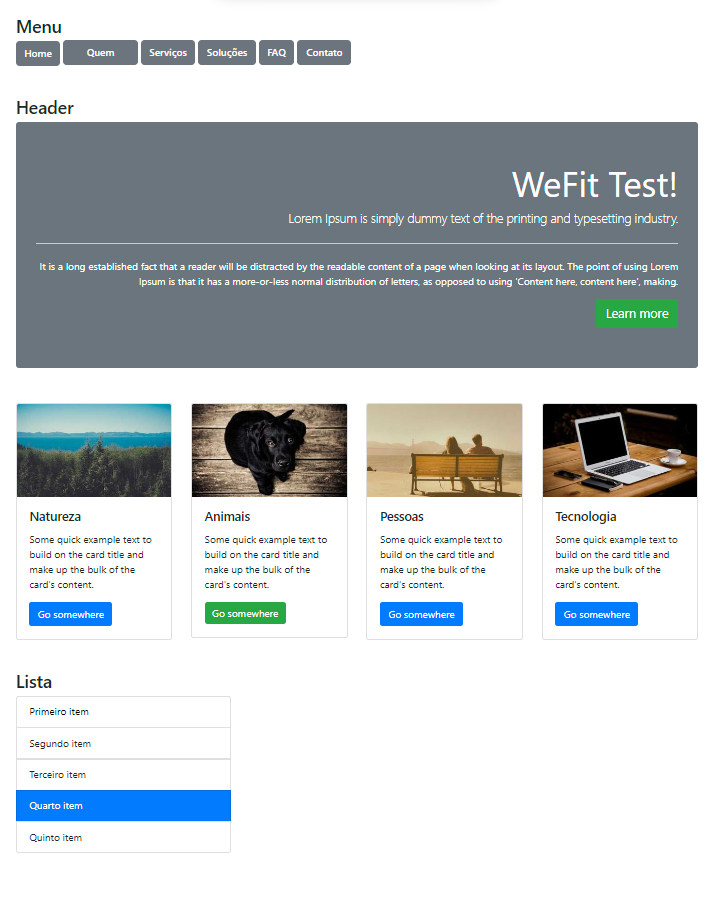

# Desafio WeFit

## Orientações de Instalação

Siga estas instruções para instalar e executar o projeto em sua máquina local:

1. Clone o repositório Git em sua máquina local.
2. Abra o terminal em seu VSCode.
3. No terminal, digite `npm install` para instalar as dependências do projeto.
4. Após a instalação das dependências, digite `npm start`. O servidor será iniciado.
5. O projeto começará a rodar.

## 🤝 Responsável pelo projeto

<table>
  <tr>
    <td align="center">
      <a href="#">
       
        
          <b> Pedro Henrique</b>
        
      </a>
    </td>
  </tr>
</table>